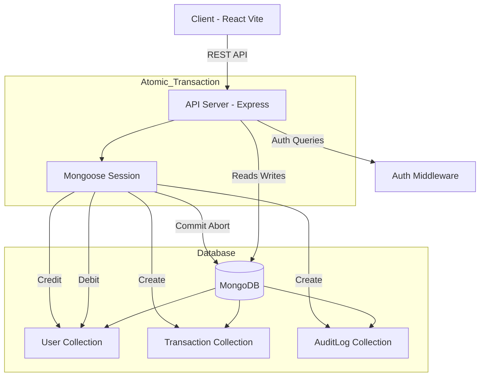

# Transaction & Audit Service

## Project Overview
This project implements a secure, atomic transaction system for fund transfers between users, coupled with a robust audit logging mechanism. It demonstrates backend transactional integrity using MongoDB Sessions and modern frontend practices for real-time updates.

### Key Features
- **Atomic Transactions**: Ensures that fund transfers (debit/credit) either completely succeed or completely fail.
- **Audit Logging**: Asynchronous logging of all transactions for compliance and history tracking.
- **Secure Authentication**: JWT-based authentication for all protected endpoints.
- **Real-time Frontend**: React-based dashboard that updates balances and transaction history instantly upon transfer.
- **Sortable History**: Dynamic table with sorting capabilities for transaction records.

### Tech Stack
- **Frontend**: React (Vite), TailwindCSS, Zustand (State Management), Axios
- **Backend**: Node.js, Express.js
- **Database**: MongoDB (Mongoose ORM) with Transactions
- **Authentication**: JWT (JSON Web Tokens), BCrypt
- **Tools**: Postman (API Testing), Git

### System Architecture


## Setup/Run Instructions

### Prerequisites
- Node.js (v18+)
- MongoDB (Local or Atlas URI)

### 1. Backend Setup
Navigate to the server directory:
```bash
cd server
```

Install dependencies:
```bash
npm install
```

Create a `.env` file in the `server` directory with the following variables:
```env
PORT=5000
MONGODB_URI=your_mongodb_connection_string
JWT_SECRET=your_jwt_secret_key
NODE_ENV=development
```

Seed the database (Optional - creates test users):
```bash
npm run seed
```

Start the backend server:
```bash
npm run dev
```
Server will run on `http://localhost:5000`.

### 2. Frontend Setup
Navigate to the client directory:
```bash
cd client
```

Install dependencies:
```bash
npm install
```

Start the frontend development server:
```bash
npm run dev
```
Frontend will typically run on `http://localhost:5173`.

## API Documentation

### Authentication
- **POST /api/auth/register**
  - Body: `{ username, email, password }`
  - Registers a new user.
- **POST /api/auth/login**
  - Body: `{ email, password }`
  - Logs in and returns a JWT token.

### Transactions
- **POST /api/transfer** (Protected)
  - Headers: `Authorization: Bearer <token>`
  - Body: `{ receiverEmail, amount }`
  - Initiates an atomic fund transfer.
- **GET /api/transactions** (Protected)
  - Headers: `Authorization: Bearer <token>`
  - Query Params: `?limit=50&sortBy=createdAt&sortOrder=desc`
  - Fetches transaction history for the authenticated user.
- **GET /api/transactions/stats** (Protected)
  - Headers: `Authorization: Bearer <token>`
  - Returns user transaction statistics (total sent, received).

## Database Schema

### User Model
| Field | Type | Description |
|-------|------|-------------|
| `_id` | ObjectId | Unique identifier |
| `username` | String | User's display name |
| `email` | String | Unique email address |
| `password` | String | Hashed password |
| `balance` | Number | Current wallet balance |

### Transaction Model
| Field | Type | Description |
|-------|------|-------------|
| `_id` | ObjectId | Unique identifier |
| `senderId` | ObjectId | Reference to User (Sender) |
| `receiverId` | ObjectId | Reference to User (Receiver) |
| `amount` | Number | Transaction amount |
| `status` | Enum | `pending`, `completed`, `failed` |
| `createdAt` | Date | Timestamp |

### AuditLog Model
| Field | Type | Description |
|-------|------|-------------|
| `_id` | ObjectId | Unique log identifier |
| `transactionId` | ObjectId | Reference to original Transaction |
| `metadata` | Object | Snapshot of balances before/after, IP, User-Agent |
| `status` | String | Final status of the operation |

## References
- [React Documentation](https://react.dev/)
- [Express.js Documentation](https://expressjs.com/)
- [MongoDB Transactions](https://www.mongodb.com/docs/manual/core/transactions/)
- [Mongoose Documentation](https://mongoosejs.com/)
- [TailwindCSS Documentation](https://tailwindcss.com/)
- [Vite Documentation](https://vitejs.dev/)

## AI Tool Usage Log 

| Task | AI Tool / Agent Action | Outcome |
|------|------------------------|---------|
| **Backend Implementation** | Generated `transactionController.js` boilerplate using MongoDB transactions (`startSession`, `startTransaction`). | Created robust atomic transfer logic ensuring data consistency. |
| **Audit Service** | Implemented `AuditService.js` and async logging pattern. | decoupled audit logging from main transaction flow for performance. |
| **Frontend Components** | Generated `TransactionHistory.jsx` with sorting logic. | Delivered a responsive, sortable table component without external libraries. |
| **Verification** | Verified API endpoints and frontend integration. | Confirmed all features work as expected (Atomicity, Real-time updates). |
| **Documentation** | Generated complete `README.md` and Database Schema documentation. | Provided clear instructions for setup and architecture overview. |

## AI-Assisted Tasks
- **Backend Implementation**: Generated `transactionController.js` boilerplate using MongoDB transactions (`startSession`, `startTransaction`). This ensured robust atomic transfer logic and data consistency.
- **Audit Service**: Implemented `AuditService.js` utilizing an async logging pattern. This decoupled audit logging from the main transaction flow, maintaining performance.
- **Frontend Components**: Generated `TransactionHistory.jsx` with built-in sorting logic. This delivered a responsive, sortable table component without relying on heavy external libraries.
- **Verification**: executed verification steps for API endpoints and frontend integration to confirm features (Atomicity, Real-time updates) worked as expected.
- **Documentation**: Generated comprehensive documentation including `README.md`, `SETUP.md`, `INSTALL_MONGODB.md`, and Database Schema diagrams.

## Effectiveness Score
**Score: 5/5**

**Justification**: The AI tool significantly accelerated the development lifecycle acting as a primary driver for both code generation and documentation. It handled complex boilerplate (like MongoDB Sessions), created a full frontend UI, and wrote extensive installation guides in a fraction of the time it would take manually. The generated solution for atomic transactions was syntactically correct and functional on the first pass, saving hours of debugging potential race conditions.


